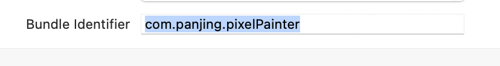
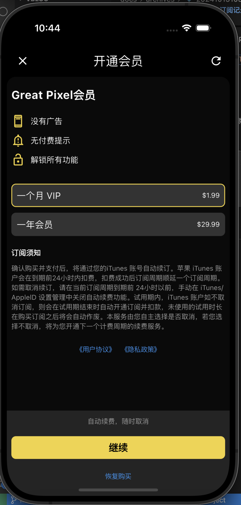

# flutter+iOS 内购订阅记录

首先要去苹果开发者中心创建内购项目，内购项目状态要为准备提交、审核中、等待审核之类的。

不能出现元数据丢失，如果提示`元数据丢失`的话，就点击内购传个图片就行了。

## 最重要

app 的 `Bundle ID` 要和内购项目一致。

打开 xcode 查看三个`Bundle ID`是否一致。

+ Profile
+ Debug
+ Relese

如果出现不一致，就会导致内购查询不到，购买不了等情况。

配置正确后，就可以愉快的赚钱了。

